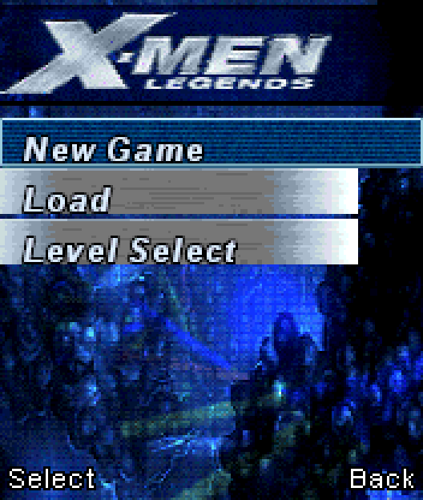
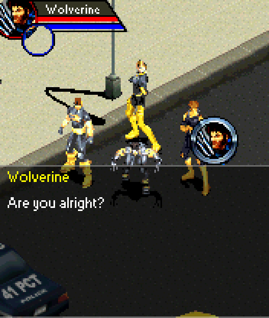
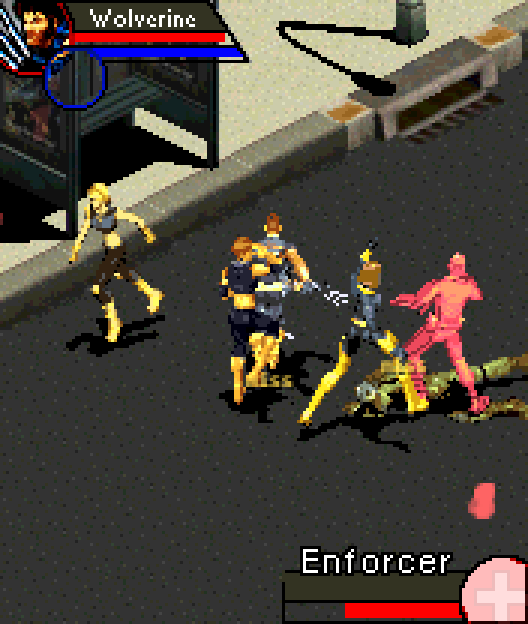
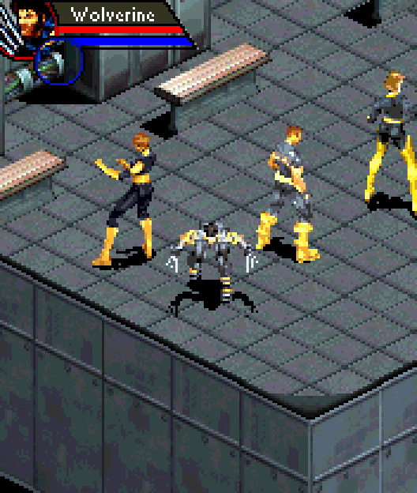
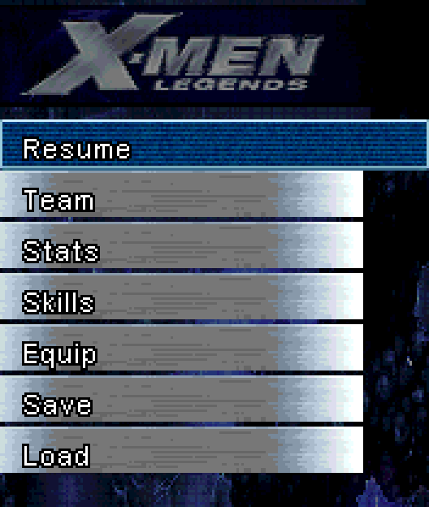
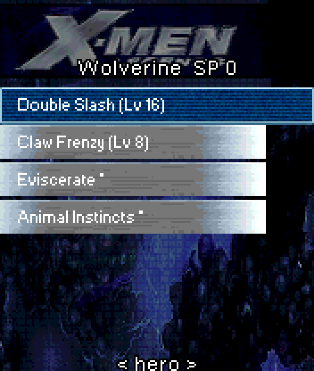
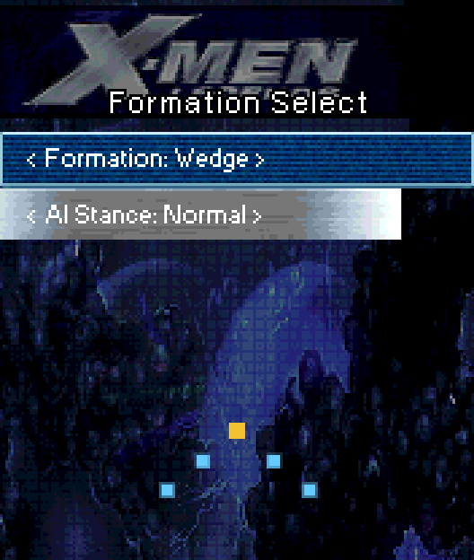
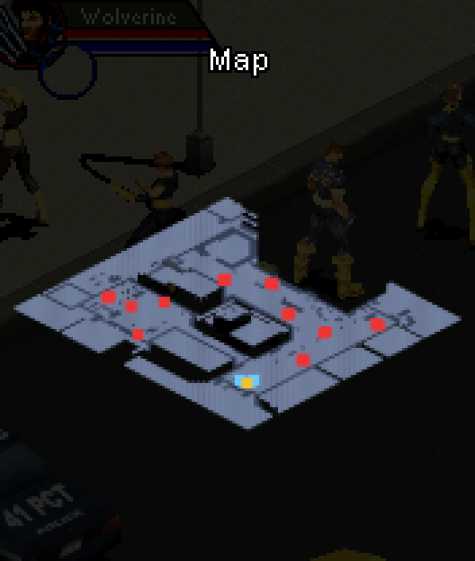

# X-Men Legends N-Gage — Web

A from-scratch JavaScript re-implementation of the engine of the N-Gage **X-Men Legends** prototype (2004),
playable in a desktop or mobile browser.

The game's content is **not** part of this repository. The engine reads the player's own `assets.pkg`
(`system/apps/6R54/assets.pkg`) at runtime. Game behaviour is re-implemented from specs reverse-engineered from the
original executable. File formats are documented in the companion
[asset viewer repo](https://github.com/KaikoClanworth1/X-Men-Legends-NGage-Asset-Viewer/blob/main/FORMATS.md).

## Screenshots

| | | |
|---|---|---|
|  |  |  |
|  |  |  |
|  |  |  |

## Running

On Windows, double-click `run.bat`: it starts a local server on port 8770 and opens the game in your browser.
Otherwise:

```bash
python -m http.server 8000
```
Open <http://localhost:8000/> and choose your `assets.pkg`. It is remembered in the browser's IndexedDB, and you can
also drop it next to `index.html`, where it is git-ignored. Dev URL parameters: `?mission=e01m01.mdd&hero=wolverine`.

Controls: arrows/WASD move · J/Space attack (N-Gage 5) · K power (7) · U specials (4) · I items (6) · L/Tab switch hero (8) · O formation (2) · 9 objectives · 0 stats · M map (3) · Enter menu / select · Esc or Backspace back · gamepad and touch supported.

## Layout

```
index.html
src/main.js              boot, asset selection/caching
src/formats/             decoders: pkg, spr, map (btm/tst/mdd), data (cdt/idf/txt)
src/engine/              assets cache, level renderer (game draw order), collision, input
src/game/                game loop, characters
docs/ROADMAP.md          milestones and status
docs/specs/              behaviour specs reverse-engineered from 6R54.app
```
